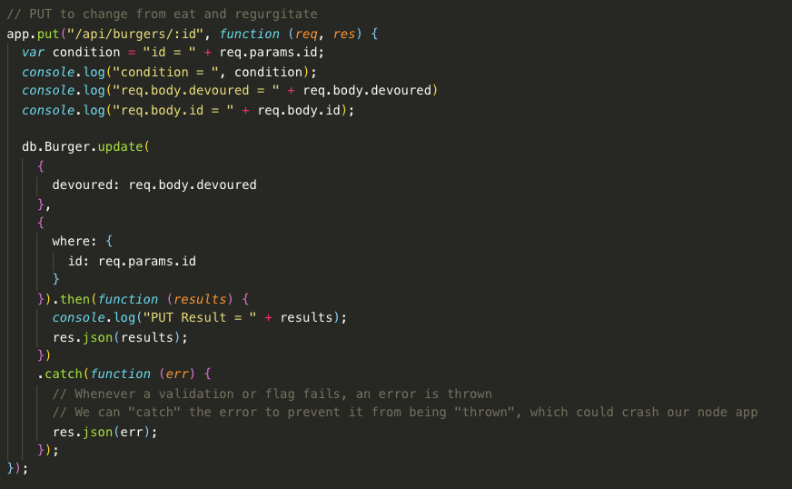
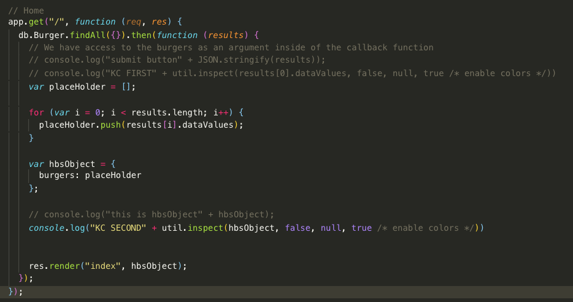
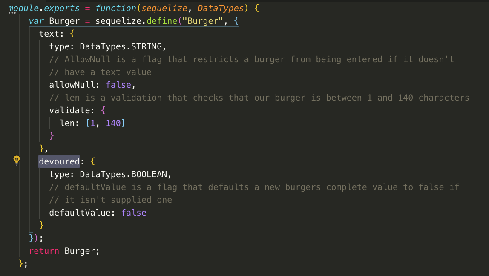
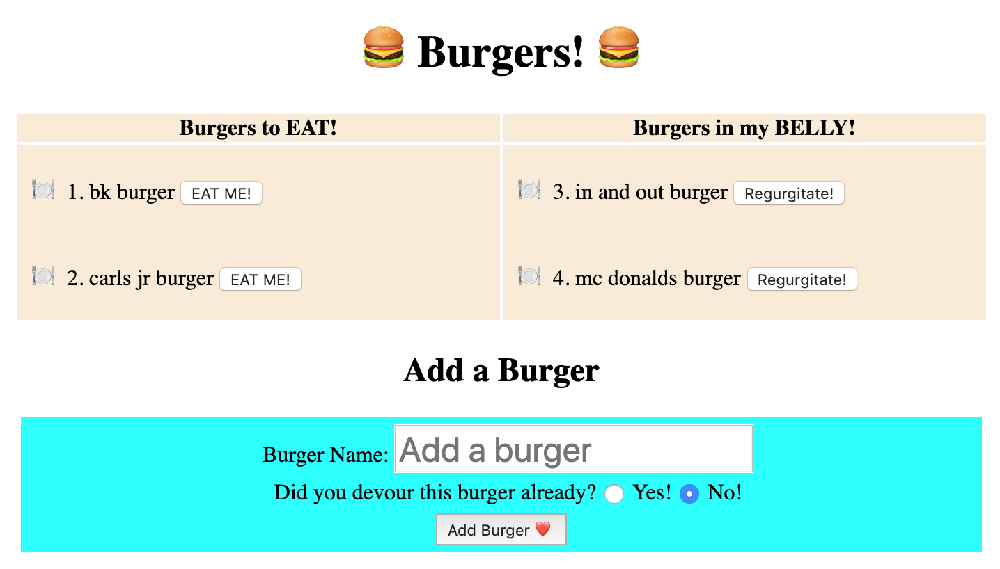
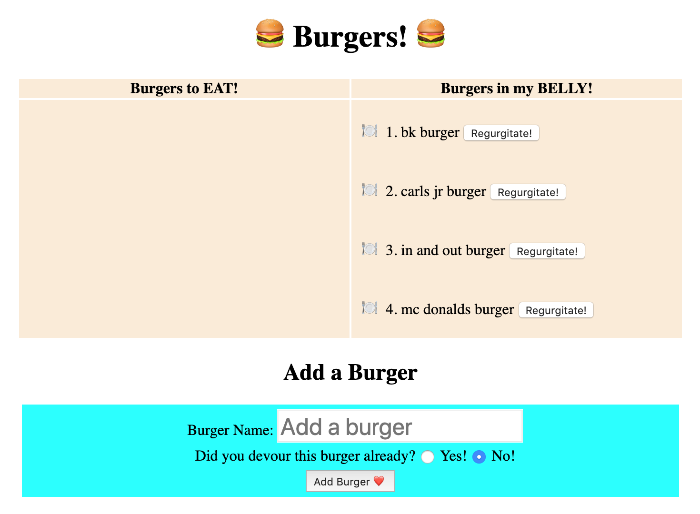
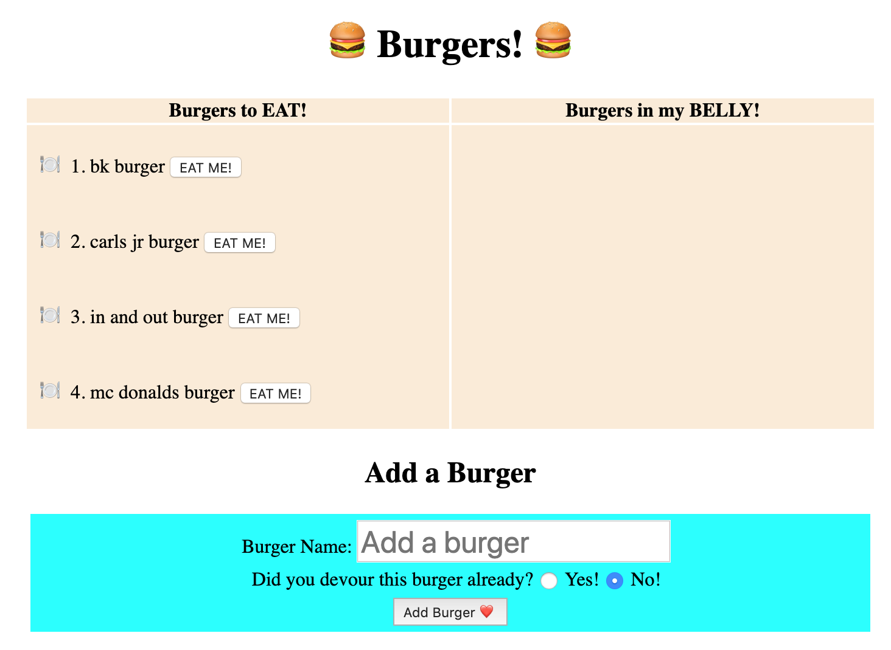
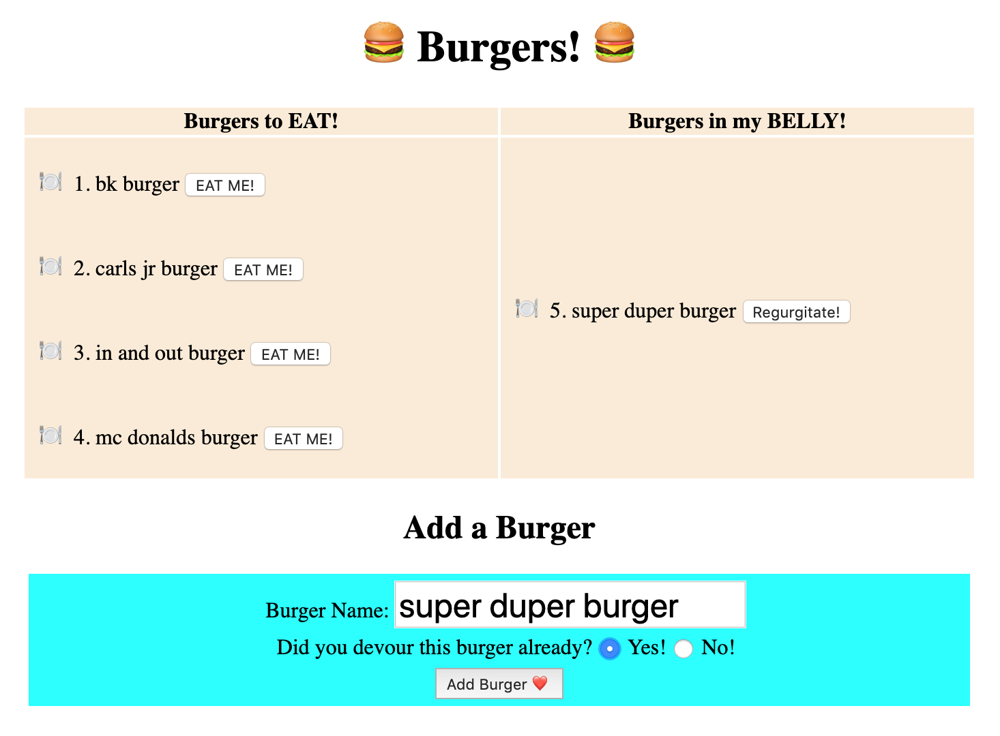
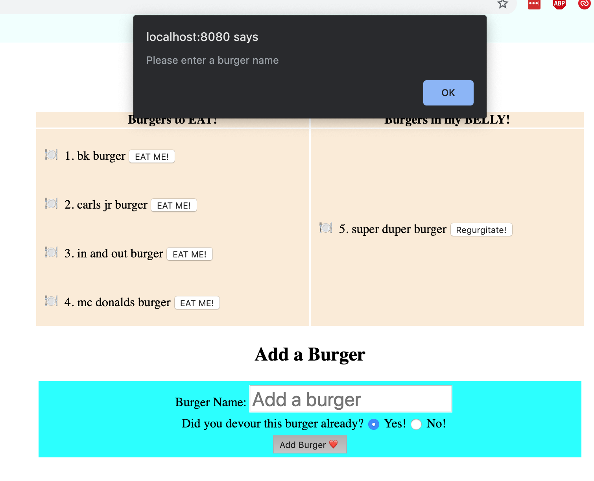

# Burger-2-The-Sequel

### Deployed site: 

### This app is the same as the Burger app but with implementing sequelize - replacing ORM, object-relational mapping. This small project was very interesting to better understand ORM and how sequelize makes the app more secure and stable. 

* Application Details: 
    - Eat a burger and regurgitate your burger to eat it again!
    - Eat Me!
    - Regurgitate
    - Add a new burger to eat

* Technology Used: 
    - node
    - express 
    - mysql2
    - sequelize

###### Code snip for updating the burgers. Setting boolean value to be set to the opposite match and change is compared to the id. 

###### Code snip for home screen. Home screen is listed with handlebars using an array push methond to be setup correctly for display. 

###### Code snip for our models. This is our template for our mysql entries.

###### Main Page

###### Eat all burgers

###### Regurgitate the burgers

###### Add a Super Duper Burger in your belly

###### Edge case without putting in a value
